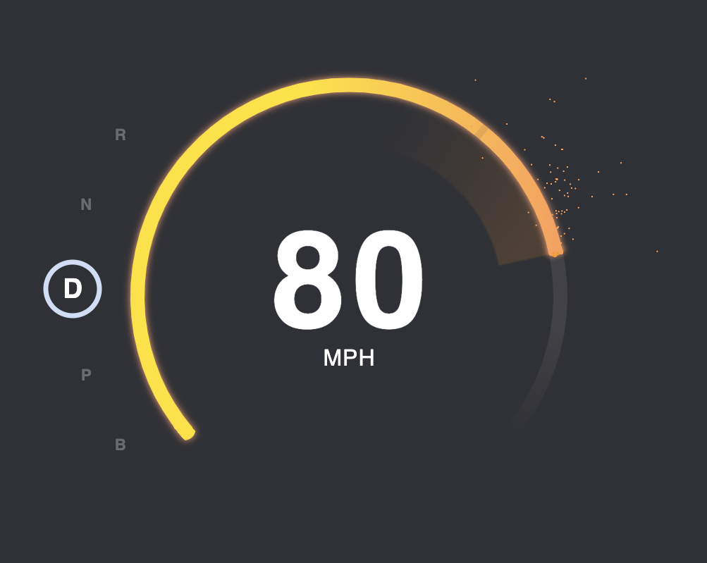

# react-svg-speedometer



## Description

The project is a Speed-O-Meter react component. It uses SVG graphics to render it's elements as well as the particle system. Motivation and UX choice explanation on the bottom of the readme.

## What can you do?

Use the **SPACE** button to accelerate, let it go to decelerate. Use arrow keys **UP** and **DOWN** to switch between gears. Please note that you can not accelerate while in **P** mode. If you do not want to hold **SPACE** you can briefly tap it to accelerate / decelerate.

## Installation

As remote node package

**Not yet possible**

As local node package

Check out the repository locally.

```bash
$ git clone git@github.com:SlawaGurevich/react-svg-speedometer.git
```

Build the project, if not done so, yet.

```bash
$ cd react-svg-speedometer
$ npm install
$ npm run build
```

Then, in you can install the component in your project folder.

```bash
npm i --save [path/to/the/cloned/folder/]svg-speedometer
```

This will create a symlink to the project.

## Usage
```javascript
import { SpeedOMeter } from 'svg-speedometer'

const YourComponent = (props) => {
	return (
		<SpeedOMeter maxSpeed={100} speedLimit={65} />
	)
}

...
```

## Options
All options are optional and can be left out in favour of the default value.

|Name|Type|Default|Description|
|---|---|---|---|
|maxSpeed|Number|100|What is the max speed|
|speedLimit|Number|65|The speed limit to show on the speedometer. Also responsible for when the bat turns yellow.|
|startFrom|Number| 0 | What speed to start from. When this is set, the speed will start from the defined value and drop down to 0 when after you stop accelerating. |
|radius|Number| 300 | The radius of the speedometer. |
|particleOptions|Object| *see bellow* | Settings for the particle system. Can be left out for default options. |

## Particle Options

The particle system works out of the box. However, you can specify more options like this. Some options are deliberately not customizable to ensure the particles work properly.

```javascript
<SpeedOMeter particleOptions={{
                              pps: 200,
                              radius: 3,
                              radiusJitter: 1,
                              ...
                             }}
						 maxSpeed={100}
						 speedLimit={65} />
```

You can use the following options:

| Name            | Type   | Default  | Description                                                  |
| --------------- | ------ | -------- | ------------------------------------------------------------ |
| pps             | Number | 500      | How many particles to generate per second (hence PPS)        |
| maxParticles    | Number | 1000     | Limit the number of particles that can be simultaneously on screen. |
| lifetime        | Number | 500      | How long the particles live (in **ms**)                      |
| xJitter         | Number | 10       | How much jitter particles should have in x-direction when being created. |
| y-Jitter        | Number | 10       | How much jitter particles should have in y-direction when being created. |
| radius          | Number | 1        | The radius of a single particle.                             |
| radiusJitter    | Number | 0        | The amoun by which the particle can be bigger by random on generation (must be positive!) |
| gravity         | Number | -15      | The amount by which particles are affected by gravitation. Set to 0 for zero gravity. Negative values cause particles to have negative gravity. |
| velocity        | Number | 1        | The amount of initial verlocity the particles have after they are generated. (Should be positive!) |
| generationScale | Number | 1        | By how many times to increase the generation of particles. Essentially, how often should the function for particle generation be called on one interation. Must be Int.  **Strongly suggest to leave this at one.** |
| fill            | String | \#fff07f | The color of the particles. Supports all colors React supports. |

## Checking component with storybook

Storybook is preinstalled in the project, so that you can check the component before using it.

```bash
$ cd react-svg-speedometer
$ npm run storybook
```

Storybook will start on port 6006 by default so visit this url to check the component.

```
http://localhost:6006
```

## Motivation and UX

I would like to say a few words regarding the design and the UI/UX of the component. First of all, I tried to match the provided design as close as possible and although it is not pixel perfect, it should be very close. I did take a few liberal changes, however.

- The R and N gears are colorized, since a lot of Japanese cars have standardized colors for those two gears.
- Acceleration is not possible when in P gear. Thus the speed indicator is faded to gray to signalize this.
- The speed limit indicator is visible on top of the speed ring, so that the user has an idea of how far over the speed limit he is driving.
- To increase the visual impact when the speed goes further over the speed limit, the gradient is constantly turning increasingly red to indicate that the maximum speed has been reached
- Particles are only produced when the user is holding the space key to simulate the grinding of metal while the car accelerates.
- There are quite a few SVG hacks that were necessary to be able to implement the desing. Since SVG does not support gradients along a curved path, a lot of the colors are trick gradients.

## Future improvements

- Prevent users to switch into **R** gear when the speed is not 0.
- Export more components (like the gauge, the particles and so on...) as their own components.
- Create an option for KMH / MPH
- More svg properties could be moved over to the scss file for better readability
- Make the particle system more sophisticated.